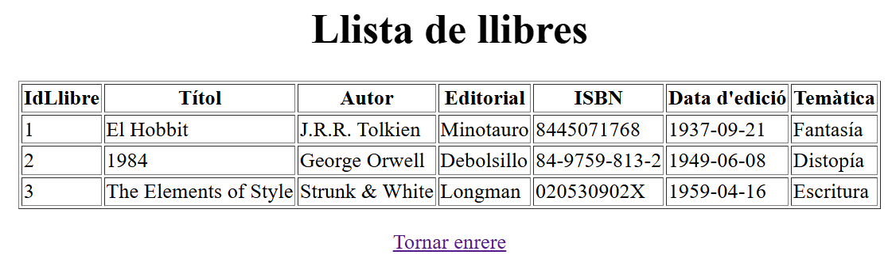
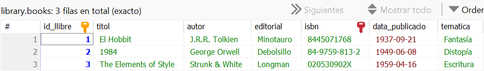
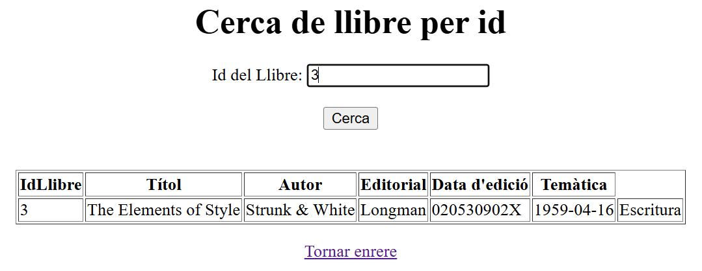
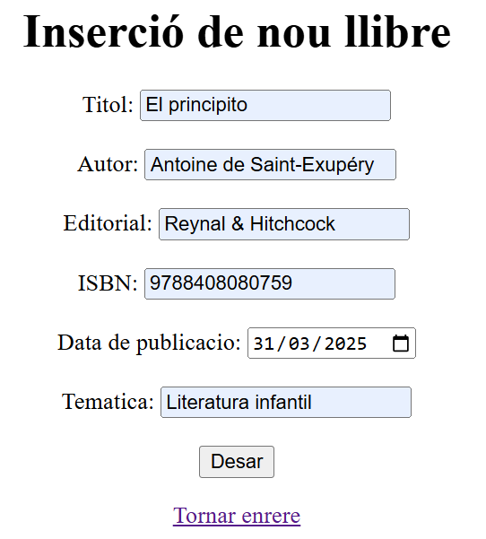
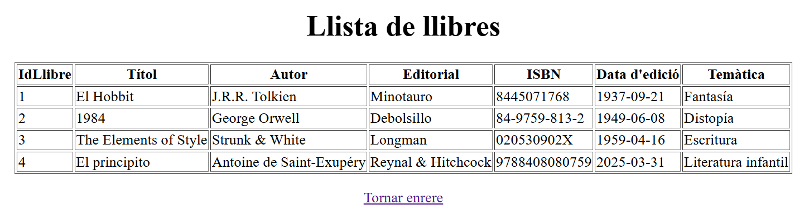
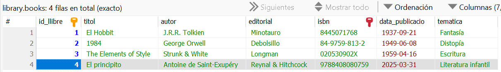

# Aplicació MVC library
Autor: Keyla Batzin
Data: 29/03/25
Grup: DAM2B

## Proves
### Mostrar tots els llibres
Web:

Base de dades:

### Creca per ID
Web:

Base de dades:

### Insertar un nou llibre
Web:

Base de dades:

## Preguntes
### 1. Per què al servei estem utilitzant mètodes que no hem declarat explícitament al repositori? Com és possible?
En Spring Data JPA, quan creem un repositori que extén CrudRepository, automàticament obtenim diversos mètodes útils per a operacions CRUD sense necessitat d'implementar-los nosaltres mateixos, gràcies a Spring Data que genera aquests mètodes en temps d'execució, com save(), findAll(), findById(), entre d'altres, que venen inclosos sense que els hàgim d'escriure.

### 2. El repositori pot elegir fer l’extends de les interfícies PagingAndSortingRepository o de JpaRepository. En què es diferencien aquestes dues amb la interfície CrudRepository?
La interfície CrudRepository proporciona mètodes bàsics per a operacions CRUD, és la més simple i només inclou el necessari per a manejar entitats, mentre que PagingAndSortingRepository extén de CrudRepository i afegeix mètodes addicionals per a manejar la paginació i l'ordenació de resultats i JpaRepository extén de PagingAndSortingRepository i afegeix encara més mètodes específics de JPA, com consultes personalitzades i mètodes per a eliminar, sent la més completa i oferint totes les funcionalitats de les dues anteriors.

### 3. Què significa Optional<Classe> i per a què serveix?
Optional<Classe> és una manera segura de manejar valors que poden ser nuls, en lloc de retornar null directament, retornem un objecte Optional que pot contenir un valor o estar buit, que permet manejar de manera més segura i clara els casos en què un valor pot no estar present, evitant errors de NullPointerException, per exemple, si busquem un llibre pel seu ID i no existeix, en lloc de retornar null, retornem un Optional buit.

### 4. Per què el controlador utilitza el servei i no la seva implementació? 
El controlador utilitza la interfície del servei ServeiLlibre en lloc de la seva implementació concreta ServeiLlibreImpl per mantenir el codi més flexible i fàcil de mantenir, ja que programar contra una interfície permet canviar la implementació del servei sense afectar el controlador, útil per a proves o si volem canviar la lògica de negoci sense modificar el controlador, a més de fer que el codi sigui més fàcil d'entendre i d'utilitzar, ja que la interfície defineix clarament quins mètodes estan disponibles.